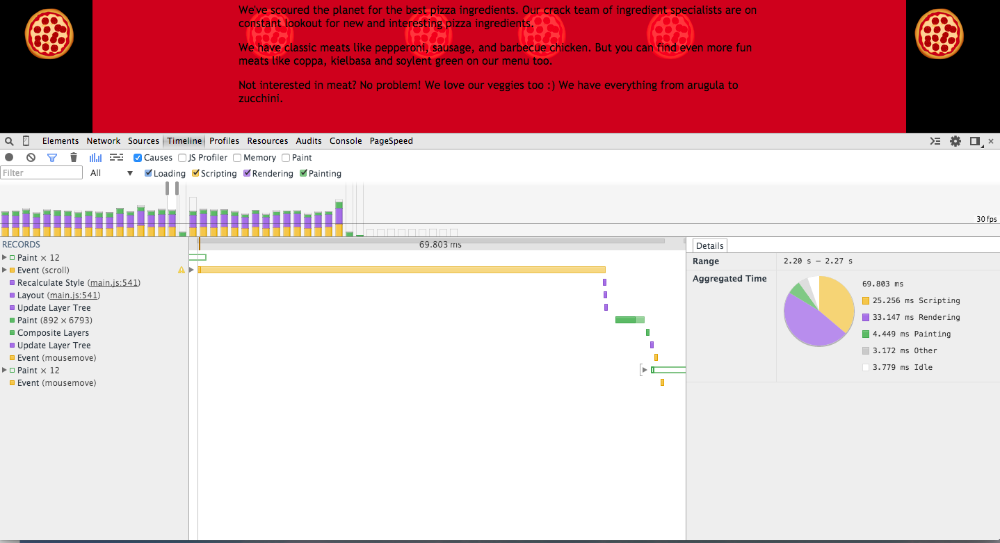
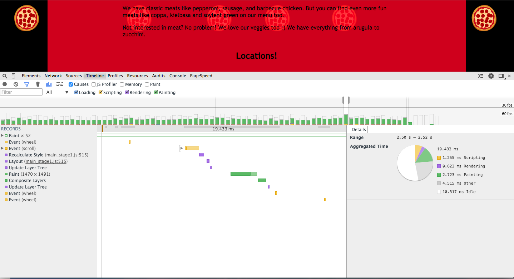
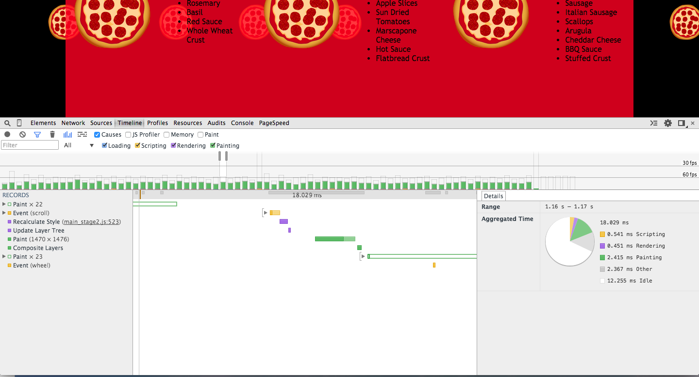
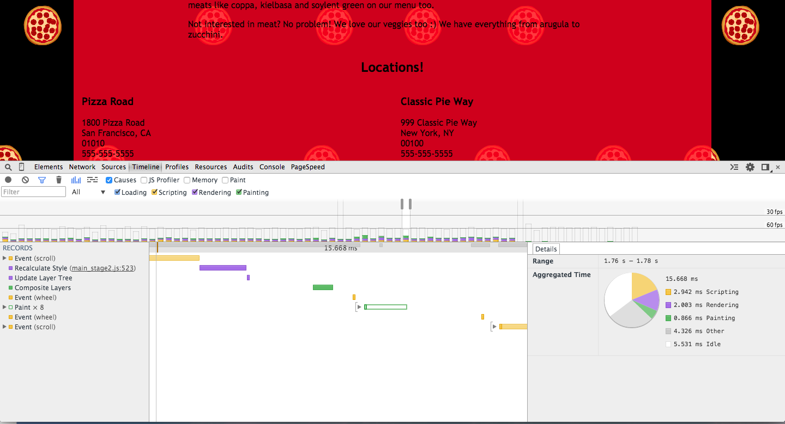

#Effective Optimizations For 60 FPS 
##Here is the Office Hours Link

Here is the link to the live [recording](https://plus.google.com/events/c8eah6f0d0t9eretebpm7dqi0ok)

##First Step: Measure

We need to use the timeline to measure the time it takes to Render and Paint our elements!

We first load up the initial site and record the framerate with the recording button (grey button to the left of our Chrome Dev Tools panel) under the "Timeline" tab. When we hit record, we scroll down the site for about two seconds and end the recording by hitting the record button again.

Here is what the FPS (Frames per Second) timeline looks like:



##First Stage Optimization:

If we isolate the timeline and look at one frame (one whole bar), we see a majority of the time is in the JavaScript that is called whenever we scroll through the page. Therefore we first optimize the JavaScript (the yellow horizonal bar) bottle neck first. For a hint, it has something to do with calculating our variables inside the For loops.

In addition on line 535 we see that we are creating 200 animating pizzas in the background. Do we necessarily need to have 200 moving pizzas created in the background if we only know a handful of them are rendered at any given time?

These are called first stage optimizations and after we optimized at the first stage, we get this timeline:



We see that we reduced our main bottle neck and we can confidentially say that our Web site is performing at 60 FPS! Notice now that the main bottlenecks are the paint events labeled: Paint (1470 x 1471). There is a lot of time taken (judging  by the size of the horizontal green bars) to paint. (1470 x 1471) tells us how many pixels are getting painted, this number basically tells us that we are painting the entire screen in the browser.

Other sources of bottlenecks are still in the JavaScript as well as a little bit of the purple events which are the Layout events. Remember the Critical Rendering Path:

* HTML -> CSSOM <- JavaScript -> Render Tree -> Layout -> Paint

We are essentially optimizing JavaScript, Layout and Paint executions.

This optimization is good enough and satisfies the project rubric.

##Second Stage Optimization:

Some students have gone beyond the First stage and have explored additional ways to reduce the time to render and paint elements on the screen.

**Reducing the Scripting Time**

First major optimization is the use of `document.querySelectorAll()`. This is one of the slowest methods to access our specified DOM elements. document.getElementsByClassName() is much faster.

Furthermore, do we necessarily need to access the DOM element for every scroll? Can we just create an array variable that has a reference to all of the pizzas that has the class name "mover"?

Also in the code, anytime we see modulo or the "%" operator we know that there is a limit to how many unique values there can be. In this case, there are only 5 unique values for phases for every scroll. Do we necessarily need to calculate all of these phases for every pizza element if we know that there are only 5 unique phases?

**Reducing Layout time**

Many people used the CSS3 TranslateX trick to use CSS3 hardware acceleration and get rid of the need to trigger a re-layout. Keep in mind how small the purple bars are contributing to the total rendering time compared to the yellow (Scripting) and green bars (Painting). 

We can get gain a little bit more efficiency if we use `transform: translateX()`, but it won't have that big of an effect that some people may believe.

Below is the new timeline with these optimizations done:



Notice how the Layout event disappears and the size of our Scripting event has gotten lower. To get a feel for the numbers, compare and contrast the time it takes to render and paint versus stage 1:

<table>
<tr>
  <td><b>Category</b></td>
  <td><b>Stage 1 time</b></td>
  <td><b>Stage 2 time</b></td>
</tr>
<tr>
  <td>Scripting</td>
  <td>1.26 ms</td>
  <td>0.54 ms</td>
</tr>
<tr>
  <td>Rendering</td>
  <td>0.62 ms</td>
  <td>0.45 ms</td>
</tr>
<tr>
  <td>Painting</td>
  <td>2.72 ms</td>
  <td>2.42 ms</td>
</tr>
</table>

##Third Stage Optimization

**Reducing the Paint time**

This hack can wreak havoc on mobile devices due to low VRAM (video memory) for some mobile devices:

`backface-visibility: hidden`

in the CSS for the "mover" class.

This hack forces each moving pizza to have its own composite layer.

When we scroll, the browser will only repaint the pixels that are affected by the moving pizzas, and therefore will not repaint the whole screen, drastically reducing our total paint time and increasing our FPS.

Other hacks developers have used are:

```
transform: translateZ(0);
transform: trnslated3d(0,0,0);
```

to force elements into their own composite layer.

Moving all of these pizzas to its own composite layer offloads the texturing and painting to the GPU (Graphics Processing Unit) or video card freeing up the CPU. But if the GPU cannot handle the extra memory load, there may be even poorer performance. Be careful and think of the tradeoffs whenever we force our elements to get rendered on its own composite layer. It's crucial to test our hacks on actual devices to make sure performance on these devices is acceptable.

Here is the new timeline with the paint optimizations done:



Notice how our paint events are really low. We have so much more bandwidth to do other things per frame now!

Please note that there seemed to be a tradeoff between Scripting and Rendering and Painting events: it looks like we've increased our Scripting and Rendering time a bit due to the overhead required to keep track of all of the multiple layers that we're rendering now.

##Conclusion

Our first step in optimizations are to measure and understand exactly what the code is doing.

We need to go through every line of the critical code and be very critical and question whether any particular line of code can be further optimized.

Comments are provided in a sample main.js [here](main.js) to see an example of a critical thought process for our critical functions.

Remember that there may be tradeoffs if we optimize one type of critical event at the expense of another critical event. It's also good to measure the performance on mutiple devices and browsers to get the best consistent optimizations we can get.
